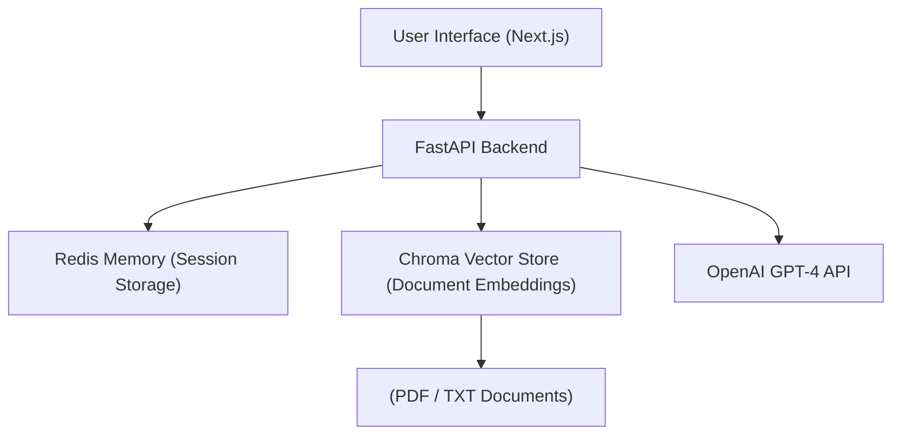

# 🎓 MSc Dissertation Project — AI-Powered RAG Chatbot

**Author:** Alexandros Tsirtiris  
**University:** University of York  
**Degree:** MSc Big Data Engineering and Data Science  
**Year:** 2025  

---

## 🧠 Project Overview

This project implements an **AI-powered chatbot** using **Retrieval-Augmented Generation (RAG)** to provide grounded, context-aware responses.  
The system combines **FastAPI**, **OpenAI GPT-4**, **Redis**, and **ChromaDB** for efficient query processing, document retrieval, and conversational memory.

The chatbot allows users to interact naturally while referencing specific documents (such as PDFs) for precise answers.  
Additional features include **dark/light mode**, **session persistence**, and **save/load chat history** for reproducibility.

---

## 🚀 Features

- **Conversational AI:** GPT-4-powered chatbot using OpenAI’s API  
- **Retrieval-Augmented Generation (RAG):**  
  Contextual responses based on document embeddings (OpenAI text-embedding-3-small)  
- **Backend:** FastAPI + Redis memory store  
- **Vector Storage:** ChromaDB for persistent embeddings  
- **Frontend:** Next.js + Tailwind CSS + TypeScript  
- **UI:** Modern interface with dark/light mode and message citations  
- **Session Management:** Save and reload chats (JSON export/import)  
- **Evaluation Pipeline:** Automated script for grounded accuracy, latency, and hallucination rate

---

## 🧩 
System Architecture



> **Figure 1:** High-level architecture showing interaction between the frontend, backend, and external APIs.
---

## ⚙️ How to Run the Project

### 🧱 Prerequisites
Before running the system, make sure you have installed:

- **Python 3.12+**
- **Node.js 18+**
- **npm** or **yarn**
- **Redis** (for session storage)
- **OpenAI API key** (create one at [https://platform.openai.com/](https://platform.openai.com/))

---

### 🧠 1️⃣ Clone the Repository
```bash
git clone https://github.com/ATsirtiris/msc-rag-chatbot.git
cd msc-rag-chatbot
```

---

### 🧩 2️⃣ Set Up the Backend (FastAPI)
Create and activate a virtual environment:

```bash
python3 -m venv venv
source venv/bin/activate  # macOS/Linux
venv\Scripts\activate     # Windows
```

Install dependencies:
```bash
pip install -r requirements.txt
```

Create a `.env` file in the project root:
```
OPENAI_API_KEY=sk-yourkeyhere
CHROMA_DIR=./vectorstore
DATA_DIR=./data
```

Start the FastAPI server:
```bash
uvicorn app.main:app --reload --port 8000
```

The backend will run on  
👉 [http://localhost:8000](http://localhost:8000)

---

### 💬 3️⃣ Set Up the Frontend (Next.js)
Open a new terminal tab in the same project folder:

```bash
cd chatbot-ui
npm install
```

Create a `.env.local` file inside `chatbot-ui`:
```
NEXT_PUBLIC_API_BASE=http://localhost:8000
```

Run the development server:
```bash
npm run dev
```

The frontend will run on  
👉 [http://localhost:3000](http://localhost:3000)

---

### 🧠 4️⃣ Optional: Enable Redis
If Redis is not running already, start it locally:

```bash
redis-server
```

Or use Docker:
```bash
docker run -d -p 6379:6379 redis
```

Redis stores chat sessions, user logins, and memory state.

---

### 🧾 5️⃣ Upload PDFs for RAG
Place your `.pdf` or `.txt` files in the `data/` folder, then run:

```bash
python -m app.ingest
```

This indexes your documents into the Chroma vector store.

---

### 🚀 6️⃣ Run the Full System
Once both backend and frontend are running:

1. Open the browser at [http://localhost:3000](http://localhost:3000)
2. **Sign up / log in**
3. Start chatting with your AI assistant  
4. Toggle **RAG ON** to enable document-grounded responses  
5. You can **Save / Load** sessions (each tied to your user account)

---

### 🧰 7️⃣ Optional: Run Evaluation Script
To measure accuracy and latency, use:
```bash
python eval.py
```

This prints grounded accuracy, hallucination rate, and latency metrics.

---

### 🎓 Summary
| Component | Tech | Command |
|------------|------|----------|
| Backend | FastAPI | `uvicorn app.main:app --reload --port 8000` |
| Frontend | Next.js | `npm run dev` |
| Redis | Session Storage | `redis-server` |
| Ingest PDFs | Chroma | `python -m app.ingest` |
| Evaluate | Eval Script | `python eval.py` |

---

> 💡 **Tip:**  
> To make your project fully portable, consider adding Docker support later — it makes deployment to Azure or other platforms one click.
